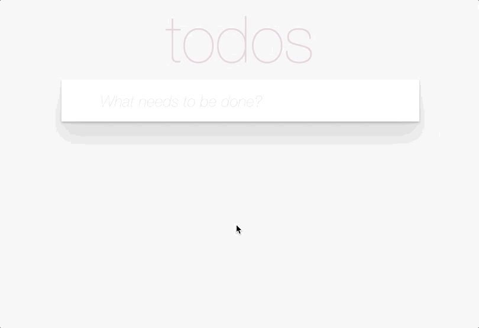
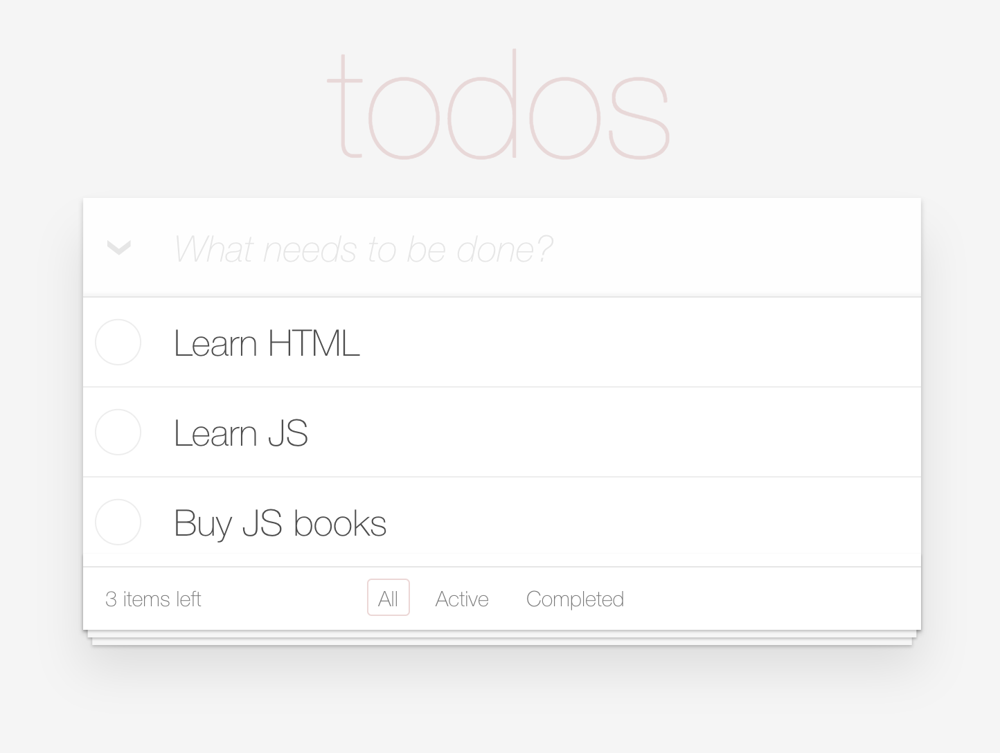

# React ToDo App
- Replace `<your_account>` with your Github username in the [DEMO LINK](https://kochatkov.github.io/react_todo-app/)
- Follow the [React task guideline](https://github.com/mate-academy/react_task-guideline#react-tasks-guideline)

## Description
Implement simple [TODO app](http://todomvc.com/examples/vanillajs/)

Requirements:
- when app loads, user sees an input to enter their TODOs
- when user types some TODO and hits enter, it's added to the list below (see the gif)
- TODO has two states: Active and Completed
- user can filter between All, Active, and Completed TODOs
- You can implement your own style or take them from the original sources
  - [base.css](http://todomvc.com/examples/vanillajs/node_modules/todomvc-common/base.css)
  - [index.css](http://todomvc.com/examples/vanillajs/node_modules/todomvc-app-css/index.css)

Below are interactions with the app:


Screenshot:


Resources:
- Font: 'helvetica neue'
- Font sizes to use: 100px, 24px, 14px
- implement arrow by rotating '❯' symbol
- Use '✕' symbol to remove TODO item on hover
- [checked](./public/icons/checked.svg)
- [unchecked](./public/icons/unchecked.svg)

## Tasks
1. Implement `TodoApp` component with an input field to create new todos on submit (Enter). Each item should have:
  - `title` - the text of todo
  - `id` - unique identifier
  - `completed` - current status (`false` by default)
1. Show the number of not completed todos in `TodoApp`
1. Implement `TodoList` component to display a list of todos ({ id, title, completed })
    ```jsx harmony
    <TodoList items={todos} />
    ```
1. Implement `TodoItem` component with ability to toggle the `complete` status.
1. Add ability to toggle the completed status of all the todos.
1. Create `TodosFilter` component to switch between `all`/`active`/`completed` todos
1. Add ability to remove an item.
1. Add ability to clear completed items from the list
1. (*) Make inline editing for the TODO item
    - double click on the TODO item text makes it editable
    - `Enter` saves changes
    - `Ecs` cancels editing

1. (*) Save state of the APP to local storage ([Required theory](https://javascript.info/localstorage))
1. (*) Implement saving an edited todo when you click outside of the input
