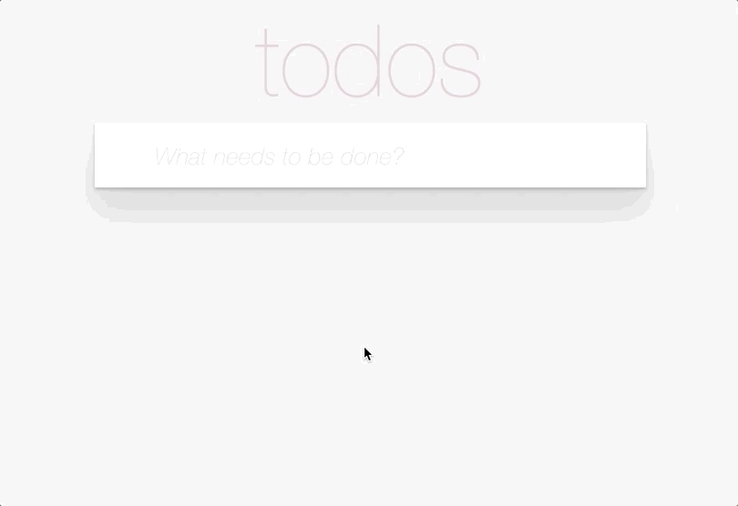
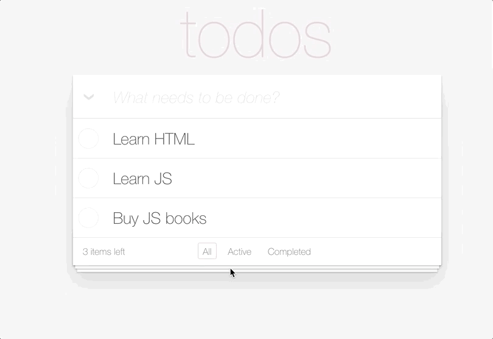

This file is a merged representation of a subset of the codebase, containing specifically included files, combined into a single document by Repomix.

<file_summary>
This section contains a summary of this file.

<purpose>
This file contains a packed representation of a subset of the repository's contents that is considered the most important context.
It is designed to be easily consumable by AI systems for analysis, code review,
or other automated processes.
</purpose>

<file_format>
The content is organized as follows:
1. This summary section
2. Repository information
3. Directory structure
4. Repository files (if enabled)
5. Multiple file entries, each consisting of:
  - File path as an attribute
  - Full contents of the file
</file_format>

<usage_guidelines>
- This file should be treated as read-only. Any changes should be made to the
  original repository files, not this packed version.
- When processing this file, use the file path to distinguish
  between different files in the repository.
- Be aware that this file may contain sensitive information. Handle it with
  the same level of security as you would the original repository.
</usage_guidelines>

<notes>
- Some files may have been excluded based on .gitignore rules and Repomix's configuration
- Binary files are not included in this packed representation. Please refer to the Repository Structure section for a complete list of file paths, including binary files
- Only files matching these patterns are included: src/**/*, README.md
- Files matching patterns in .gitignore are excluded
- Files matching default ignore patterns are excluded
- Files are sorted by Git change count (files with more changes are at the bottom)
</notes>

</file_summary>

<directory_structure>
src/
  styles/
    filters.scss
    index.scss
    todo-list.scss
    todoapp.scss
  App.tsx
  index.tsx
  vite-env.d.ts
README.md
</directory_structure>

<files>
This section contains the contents of the repository's files.

<file path="src/styles/filters.scss">
.filter {
  display: flex;

  &__link {
    margin: 3px;
    padding: 3px 7px;

    color: inherit;
    text-decoration: none;

    border: 1px solid transparent;
    border-radius: 3px;

    &:hover {
      border-color: rgba(175, 47, 47, 0.1);
    }

    &.selected {
      border-color: rgba(175, 47, 47, 0.2);
    }
  }
}
</file>

<file path="src/styles/todo-list.scss">
.todo {
  position: relative;

  display: grid;
  grid-template-columns: 45px 1fr;
  justify-items: stretch;

  font-size: 24px;
  line-height: 1.4em;
  border-bottom: 1px solid #ededed;

  &:last-child {
    border-bottom: 0;
  }

  &__status-label {
    cursor: pointer;
    background-image: url('data:image/svg+xml;utf8,%3Csvg%20xmlns%3D%22http%3A//www.w3.org/2000/svg%22%20width%3D%2240%22%20height%3D%2240%22%20viewBox%3D%22-10%20-18%20100%20135%22%3E%3Ccircle%20cx%3D%2250%22%20cy%3D%2250%22%20r%3D%2250%22%20fill%3D%22none%22%20stroke%3D%22%23ededed%22%20stroke-width%3D%223%22/%3E%3C/svg%3E');
    background-repeat: no-repeat;
    background-position: center left;
  }

  &.completed &__status-label {
    background-image: url('data:image/svg+xml;utf8,%3Csvg%20xmlns%3D%22http%3A//www.w3.org/2000/svg%22%20width%3D%2240%22%20height%3D%2240%22%20viewBox%3D%22-10%20-18%20100%20135%22%3E%3Ccircle%20cx%3D%2250%22%20cy%3D%2250%22%20r%3D%2250%22%20fill%3D%22none%22%20stroke%3D%22%23bddad5%22%20stroke-width%3D%223%22/%3E%3Cpath%20fill%3D%22%235dc2af%22%20d%3D%22M72%2025L42%2071%2027%2056l-4%204%2020%2020%2034-52z%22/%3E%3C/svg%3E');
  }

  &__status {
    opacity: 0;
  }

  &__title {
    padding: 12px 15px;

    word-break: break-all;
    transition: color 0.4s;
  }

  &.completed &__title {
    color: #d9d9d9;
    text-decoration: line-through;
  }

  &__remove {
    position: absolute;
    right: 12px;
    top: 0;
    bottom: 0;

    font-size: 120%;
    line-height: 1;
    font-family: inherit;
    font-weight: inherit;
    color: #cc9a9a;

    float: right;
    border: 0;
    background: none;
    cursor: pointer;

    transform: translateY(-2px);
    opacity: 0;
    transition: color 0.2s ease-out;

    &:hover {
      color: #af5b5e;
    }
  }

  &:hover &__remove {
    opacity: 1;
  }

  &__title-field {
    width: 100%;
    padding: 11px 14px;

    font-size: inherit;
    line-height: inherit;
    font-family: inherit;
    font-weight: inherit;
    color: inherit;

    border: 1px solid #999;
    box-shadow: inset 0 -1px 5px 0 rgba(0, 0, 0, 0.2);

    &::placeholder {
      font-style: italic;
      font-weight: 300;
      color: #e6e6e6;
    }
  }

  .overlay {
    position: absolute;
    inset: 0;

    opacity: 0.5;
  }
}
</file>

<file path="src/styles/todoapp.scss">
.todoapp {
  font-family: 'Helvetica Neue', Helvetica, Arial, sans-serif;
  font-size: 24px;
  font-weight: 300;
  color: #4d4d4d;
  margin: 40px 20px;

  &__content {
    margin-bottom: 20px;
    background: #fff;
    box-shadow:
      0 2px 4px 0 rgba(0, 0, 0, 0.2),
      0 25px 50px 0 rgba(0, 0, 0, 0.1);
  }

  &__title {
    font-size: 100px;
    font-weight: 100;
    text-align: center;
    color: rgba(175, 47, 47, 0.15);
    -webkit-text-rendering: optimizeLegibility;
    -moz-text-rendering: optimizeLegibility;
    text-rendering: optimizeLegibility;
  }

  &__header {
    position: relative;
  }

  &__toggle-all {
    position: absolute;

    height: 100%;
    width: 45px;

    display: flex;
    justify-content: center;
    align-items: center;

    font-size: 24px;
    color: #e6e6e6;

    border: 0;
    background-color: transparent;
    cursor: pointer;

    &.active {
      color: #737373;
    }

    &::before {
      content: '❯';
      transform: translateY(2px) rotate(90deg);
      line-height: 0;
    }
  }

  &__new-todo {
    width: 100%;
    padding: 16px 16px 16px 60px;

    font-size: 24px;
    line-height: 1.4em;
    font-family: inherit;
    font-weight: inherit;
    color: inherit;
    -webkit-font-smoothing: antialiased;
    -moz-osx-font-smoothing: grayscale;

    border: none;
    background: rgba(0, 0, 0, 0.01);
    box-shadow: inset 0 -2px 1px rgba(0, 0, 0, 0.03);

    &::placeholder {
      font-style: italic;
      font-weight: 300;
      color: #e6e6e6;
    }
  }

  &__main {
    border-top: 1px solid #e6e6e6;
  }

  &__footer {
    display: flex;
    justify-content: space-between;
    align-items: center;

    box-sizing: content-box;
    height: 20px;
    padding: 10px 15px;

    font-size: 14px;

    color: #777;
    text-align: center;
    border-top: 1px solid #e6e6e6;

    box-shadow:
      0 1px 1px rgba(0, 0, 0, 0.2),
      0 8px 0 -3px #f6f6f6,
      0 9px 1px -3px rgba(0, 0, 0, 0.2),
      0 16px 0 -6px #f6f6f6,
      0 17px 2px -6px rgba(0, 0, 0, 0.2);
  }

  &__clear-completed {
    margin: 0;
    padding: 0;
    border: 0;

    font-family: inherit;
    font-weight: inherit;
    color: inherit;
    text-decoration: none;

    cursor: pointer;
    background: none;

    -webkit-appearance: none;
    appearance: none;
    -webkit-font-smoothing: antialiased;
    -moz-osx-font-smoothing: grayscale;

    &:hover {
      text-decoration: underline;
    }

    &:active {
      text-decoration: none;
    }
  }
}
</file>

<file path="src/vite-env.d.ts">
/// <reference types="vite/client" />
</file>

<file path="src/styles/index.scss">
iframe {
  display: none;
}

body {
  min-width: 230px;
  max-width: 550px;
  margin: 0 auto;
}

.notification {
  transition-property: opacity, min-height;
  transition-duration: 1s;
  min-height: 36px;
}

.notification.hidden {
  min-height: 0;
  opacity: 0;
  pointer-events: none;
}

@import './todoapp';
@import './todo-list';
@import './filters';
</file>

<file path="src/App.tsx">
/* eslint-disable jsx-a11y/control-has-associated-label */
import React from 'react';

export const App: React.FC = () => {
  return (
    

      <h1 className="todoapp__title">todos</h1>

      

        <header className="todoapp__header">
          {/* this button should have `active` class only if all todos are completed */}
          <button
            type="button"
            className="todoapp__toggle-all active"
            data-cy="ToggleAllButton"
          />

          {/* Add a todo on form submit */}
          <form>
            <input
              data-cy="NewTodoField"
              type="text"
              className="todoapp__new-todo"
              placeholder="What needs to be done?"
            />
          </form>
        </header>

        <section className="todoapp__main" data-cy="TodoList">
          {/* This is a completed todo */}
          

            <label className="todo__status-label">
              <input
                data-cy="TodoStatus"
                type="checkbox"
                className="todo__status"
                checked
              />
            </label>

            
              Completed Todo
            

            {/* Remove button appears only on hover */}
            <button type="button" className="todo__remove" data-cy="TodoDelete">
              ×
            </button>
          

          {/* This todo is an active todo */}
          

            <label className="todo__status-label">
              <input
                data-cy="TodoStatus"
                type="checkbox"
                className="todo__status"
              />
            </label>

            
              Not Completed Todo
            

            <button type="button" className="todo__remove" data-cy="TodoDelete">
              ×
            </button>
          

          {/* This todo is being edited */}
          

            <label className="todo__status-label">
              <input
                data-cy="TodoStatus"
                type="checkbox"
                className="todo__status"
              />
            </label>

            {/* This form is shown instead of the title and remove button */}
            <form>
              <input
                data-cy="TodoTitleField"
                type="text"
                className="todo__title-field"
                placeholder="Empty todo will be deleted"
                value="Todo is being edited now"
              />
            </form>
          

          {/* This todo is in loadind state */}
          

            <label className="todo__status-label">
              <input
                data-cy="TodoStatus"
                type="checkbox"
                className="todo__status"
              />
            </label>

            
              Todo is being saved now
            

            <button type="button" className="todo__remove" data-cy="TodoDelete">
              ×
            </button>
          

        </section>

        {/* Hide the footer if there are no todos */}
        <footer className="todoapp__footer" data-cy="Footer">
          
            3 items left
          

          {/* Active link should have the 'selected' class */}
          <nav className="filter" data-cy="Filter">
            <a
              href="#/"
              className="filter__link selected"
              data-cy="FilterLinkAll"
            >
              All
            </a>

            <a
              href="#/active"
              className="filter__link"
              data-cy="FilterLinkActive"
            >
              Active
            </a>

            <a
              href="#/completed"
              className="filter__link"
              data-cy="FilterLinkCompleted"
            >
              Completed
            </a>
          </nav>

          {/* this button should be disabled if there are no completed todos */}
          <button
            type="button"
            className="todoapp__clear-completed"
            data-cy="ClearCompletedButton"
          >
            Clear completed
          </button>
        </footer>
      

    

  );
};
</file>

<file path="src/index.tsx">
import { createRoot } from 'react-dom/client';

import './styles/index.scss';

import { App } from './App';

const container = document.getElementById('root') as HTMLDivElement;

createRoot(container).render(<App />);
</file>

<file path="README.md">
# React ToDo App

Implement a simple [TODO app](https://mate-academy.github.io/react_todo-app/) that functions as described below.

> If you are unsure about how a feature should work, open the real TodoApp and observe its behavior.

1. Learn the markup in `App.tsx`.
2. Show only a field to create a new todo if there are no todos yet.
3. Use React Context to manage todos.
4. Each todo should have an `id` (you can use `+new Date()`), a `title`, and a `completed` status (`false` by default).
5. Save `todos` to `localStorage` using `JSON.stringify` after each change.
6. Display the number of not completed todos in `TodoApp`.
7. Implement filtering by status (`All`/`Active`/`Completed`).
8. Add the ability to delete a todo using the `x` button.
9. Implement the `clearCompleted` button (disabled if there are no completed todos).
10. Implement individual todo status toggling.
11. Implement the `toggleAll` checkbox (checked only when all todos are completed).
12. Enable inline editing for the `TodoItem`:
    - Double-clicking on the todo title shows a text field instead of the title and `deleteButton`.
    - Form submission saves changes (press `Enter` to save).
    - Trim the saved text.
    - Delete the todo if the title is empty.
    - Save changes `onBlur`.
    - Pressing `Escape` cancels editing (use `onKeyUp` and check if `event.key === 'Escape'`).

## Instructions

- Install the Prettier Extension and use these [VSCode settings](https://mate-academy.github.io/fe-program/tools/vscode/settings.json) to enable format on save.
- Implement a solution following the [React task guidelines](https://github.com/mate-academy/react_task-guideline#react-tasks-guideline).
- Use the [React TypeScript cheat sheet](https://mate-academy.github.io/fe-program/js/extra/react-typescript).
- Open another terminal and run tests with `npm test` to ensure your solution is correct.
- Replace `<your_account>` with your GitHub username in the [DEMO LINK](https://<your_account>.github.io/react_todo-app/) and add it to the PR description.
</file>

</files>
